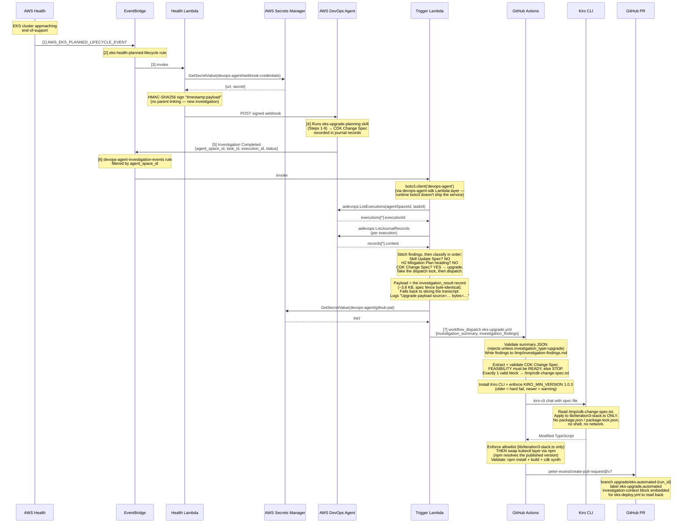
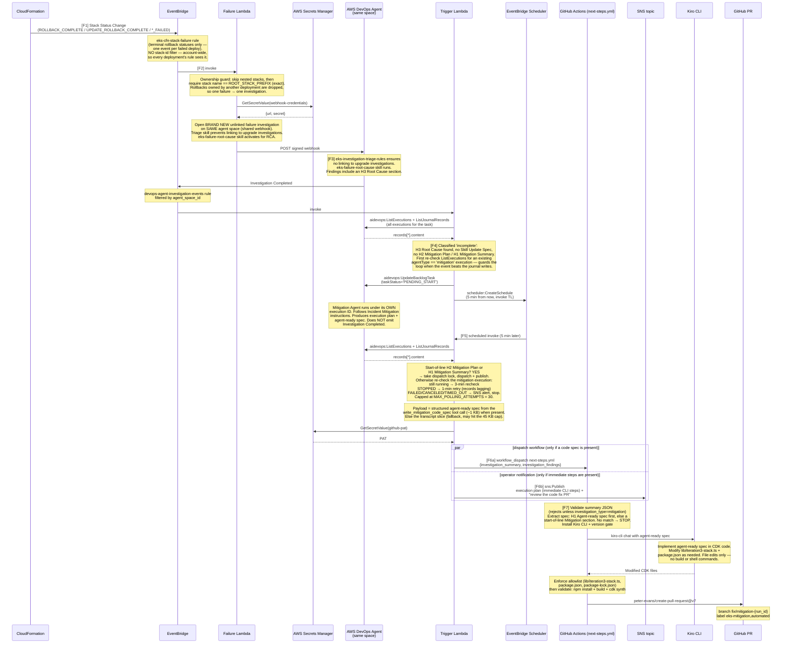
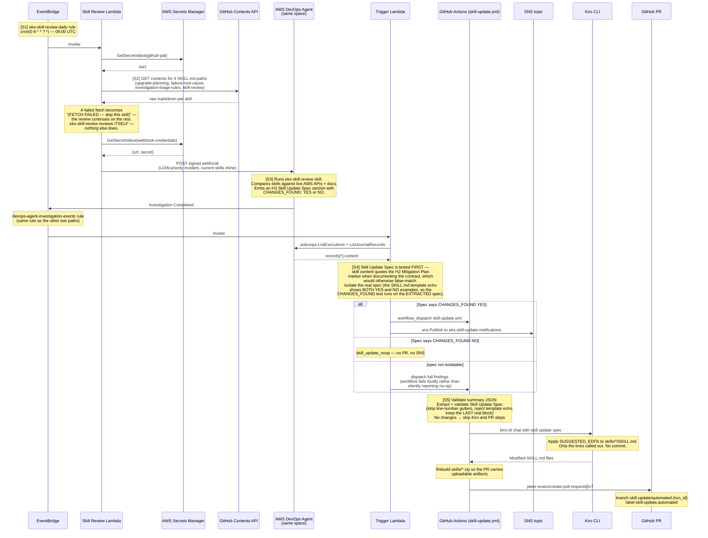

# EKS Automated Upgrade Pipeline — Architecture

Detailed walkthrough in [`event-workflow.md`](./event-workflow.md).

Three event paths share one agent space, one `Investigation Completed` EventBridge
rule (`devops-agent-investigation-events`), and one Trigger Lambda that routes by
content marker. All resource names below are the un-suffixed form; deploying with
`NAME_SUFFIX` set appends `-<suffix>` to every name so several stacks can coexist
in one account.

## Sequence — upgrade path

## Sequence — failure path (closed loop, single agent space with skill-based isolation + polling)

## Sequence — skill review path (daily maintenance)

## Components

```mermaid
flowchart TB
    subgraph "Event Sources"
        Health["☁️ AWS Health<br/><i>Planned Lifecycle events</i>"]
        CFN["☁️ CloudFormation<br/><i>Stack Status Change</i>"]
        Cron["🕗 Daily schedule tick<br/><i>08:00 UTC</i>"]
        Agent["🤖 DevOps Agent<br/><i>single space, named after the cluster</i><br/><i>Skills: eks-upgrade-planning,<br/>eks-investigation-triage-rules,<br/>eks-failure-root-cause,<br/>eks-skill-review</i>"]
    end

    subgraph "Event Routing"
        EB["📡 EventBridge<br/><i>4 rules, each also logging to<br/>/aws/events/eks-upgrade-pipeline</i>"]
        Sched["⏰ EventBridge Scheduler<br/><i>one-time polling for mitigation completion<br/>+ deterministic dispatch locks</i>"]
    end

    subgraph "Lambdas"
        HL["⚡ devops-agent-health-event<br/><i>opens upgrade-planning investigation</i>"]
        FL["⚡ devops-agent-upgrade-failure-event<br/><i>opens unlinked failure investigation<br/>(same space; triage skill prevents linking)</i>"]
        SRL["⚡ devops-agent-skill-review-trigger<br/><i>fetches 4 SKILL.md from GitHub,<br/>opens skill-review investigation</i>"]
        TL["⚡ devops-agent-trigger-upgrade<br/><i>boto3 ListExecutions + ListJournalRecords +<br/>UpdateBacklogTask via devops-agent-sdk layer</i><br/><i>Routes by content marker, in order:<br/>Skill Update Spec → skill-update.yml + SNS (or no-op)<br/>Mitigation Plan/Summary → next-steps.yml + SNS<br/>CDK Change Spec → eks-upgrade.yml<br/>Root Cause only → UpdateBacklogTask + schedule poll<br/>none → logged no-op</i>"]
        DLQ["📮 devops-agent-lambda-dlq<br/><i>async failures, all 4 Lambdas</i>"]
    end

    subgraph "Secrets"
        SM1["🔐 devops-agent/webhook-credentials<br/><i>read by Health, Failure, Skill Review</i>"]
        SM2["🔐 devops-agent/github-pat<br/><i>read by Trigger, Skill Review</i>"]
        KMS["🔑 alias/devops-agent-secrets"]
    end

    subgraph "External"
        UpgradeGHA["🔄 eks-upgrade.yml"]
        NextStepsGHA["🔄 next-steps.yml"]
        SkillGHA["🔄 skill-update.yml"]
        DeployGHA["🔄 eks-deploy.yml<br/><i>manual, post-merge</i>"]
        Kiro["🤖 Kiro CLI<br/><i>--trust-tools=read,write,glob,grep</i>"]
        UpgradePR["📝 CDK PR"]
        NextStepsPR["📝 Code fix PR"]
        SkillPR["📝 Skill update PR"]
        SNS1["📣 eks-upgrade-failure-mitigation<br/><i>mitigation plan + failure/timeout alerts</i>"]
        SNS2["📣 eks-skill-update-notifications<br/><i>skill changes + review timeouts</i>"]
    end

    Health -->|"PLE event"| EB
    CFN -->|"rollback terminal"| EB
    Cron -->|"eks-skill-review-daily"| EB
    Agent -->|"Investigation Completed"| EB

    EB --> HL
    EB --> FL
    EB --> SRL
    EB --> TL
    Sched -->|"scheduled invoke"| TL

    HL -.-> DLQ
    FL -.-> DLQ
    SRL -.-> DLQ
    TL -.-> DLQ
    SM1 --- KMS
    SM2 --- KMS

    HL -->|"GetSecretValue"| SM1
    HL -->|"signed webhook"| Agent

    FL -->|"GetSecretValue"| SM1
    FL -->|"signed webhook"| Agent

    SRL -->|"GetSecretValue"| SM1
    SRL -->|"GetSecretValue"| SM2
    SRL -->|"signed webhook"| Agent

    TL -->|"GetSecretValue"| SM2
    TL -->|"ListExecutions + ListJournalRecords"| Agent
    TL -->|"UpdateBacklogTask"| Agent
    TL -->|"CreateSchedule (poll + lock)"| Sched
    TL -->|"workflow_dispatch<br/>(CDK Change Spec)"| UpgradeGHA
    TL -->|"workflow_dispatch<br/>(Mitigation Plan/Summary<br/>+ code spec)"| NextStepsGHA
    TL -->|"workflow_dispatch<br/>(CHANGES_FOUND: YES)"| SkillGHA
    TL -->|"sns:Publish<br/>(if immediate steps)"| SNS1
    TL -->|"sns:Publish"| SNS2

    UpgradeGHA --> Kiro
    NextStepsGHA --> Kiro
    SkillGHA --> Kiro
    UpgradeGHA --> UpgradePR
    NextStepsGHA --> NextStepsPR
    SkillGHA --> SkillPR
    UpgradePR -->|"merge, then manual run"| DeployGHA
```

## Deployment boundaries

| Boundary | Components | Managed via |
|---|---|---|
| CloudFormation stack (`devops-agent-space.yaml`) | Single Agent Space, IAM, 4 EventBridge rules, 4 Lambdas + `devops-agent-sdk` layer, Secrets Manager + KMS key, 2 SNS topics, DLQ, EventBridge log group, Scheduler Role | `aws cloudformation deploy` (run by `bootstrap.sh`) |
| CDK stack (`lib/iteration3-stack.ts`) | EKS cluster, addons, node group, Helm charts | `cdk deploy` (run by `bootstrap.sh` or `eks-deploy.yml`) |
| GitHub | `eks-upgrade.yml`, `next-steps.yml`, `skill-update.yml`, `eks-deploy.yml` | repo |
| DevOps Agent space | Global Instructions, agent-type instructions, 4 skills, generic webhook | manual config after `bootstrap.sh` |

Set `NAME_SUFFIX` to run more than one deployment in a single account — the CFN
stack suffixes every resource name and the CDK stack becomes
`EksUpgradePocStack-<suffix>`.

## Key data flows

| Step | From | To | Data | Protocol |
|---|---|---|---|---|
| [1] | AWS Health | EventBridge | PLE event | EventBridge native |
| [3] | EventBridge | Health Lambda | Health event JSON | Lambda invoke |
| [3] | Health Lambda | DevOps Agent | HMAC-signed webhook (new upgrade-planning investigation) | HTTPS POST |
| [5] | DevOps Agent | EventBridge | Investigation Completed metadata | EventBridge native |
| [6] | Trigger Lambda | DevOps Agent | `aidevops:ListExecutions`, then `aidevops:ListJournalRecords` per execution (via boto3 in the `devops-agent-sdk` Lambda layer) | HTTPS POST |
| [7] | Trigger Lambda | GitHub API | `workflow_dispatch` — `eks-upgrade.yml` (CDK Change Spec), `next-steps.yml` (Mitigation Plan), or `skill-update.yml` (Skill Update Spec) | HTTPS POST |
| [9] | Kiro CLI | repo files | Modified TypeScript (upgrade or code fix) or `skills/*/SKILL.md` | filesystem |
| [F2] | Failure Lambda | DevOps Agent (same space) | HMAC-signed webhook (unlinked failure investigation; triage skill prevents linking) | HTTPS POST |
| [F4] | Trigger Lambda | DevOps Agent | `aidevops:UpdateBacklogTask(PENDING_START)` | HTTPS POST |
| [F4] | Trigger Lambda | EventBridge Scheduler | `scheduler:CreateSchedule` (5-min one-time poll; 3-min or 1-min on recheck) | HTTPS POST |
| [F5] | EventBridge Scheduler | Trigger Lambda | Scheduled invoke (polling for mitigation completion, max 30 attempts) | Lambda invoke |
| [F6b] | Trigger Lambda | `eks-upgrade-failure-mitigation` | Execution plan (immediate CLI steps, excludes Code Change Spec) | sns:Publish |
| [S2] | Skill Review Lambda | GitHub API | `GET /repos/{repo}/contents/{path}` × 4 SKILL.md | HTTPS GET |
| [S2] | Skill Review Lambda | DevOps Agent | HMAC-signed webhook (skill-review investigation, skills inline) | HTTPS POST |
| [S4] | Trigger Lambda | `eks-skill-update-notifications` | Detected skill changes + pointer to the PR | sns:Publish |
| — | Trigger Lambda | SNS (routed by task type) | `TIMED_OUT` alert — skill reviews to `eks-skill-update-notifications`, everything else to `eks-upgrade-failure-mitigation` | sns:Publish |
