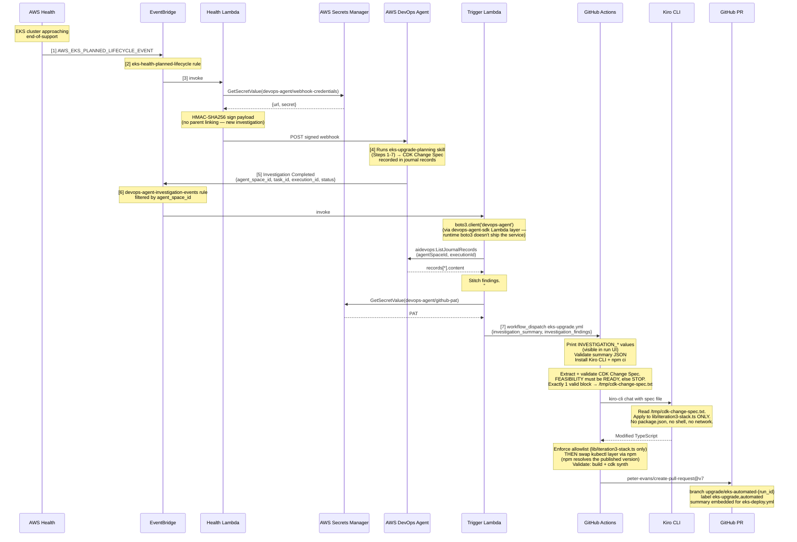
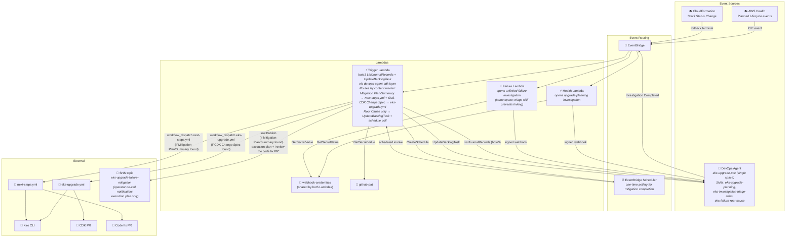

# EKS Automated Upgrade Pipeline — Architecture

Detailed walkthrough in [`event-workflow.md`](./event-workflow.md).

## Sequence — upgrade path



## Sequence — failure path (closed loop, single agent space with skill-based isolation + polling)

```mermaid
sequenceDiagram
    participant CFN as CloudFormation
    participant EB as EventBridge
    participant FL as Failure Lambda
    participant SM as AWS Secrets Manager
    participant DA as AWS DevOps Agent<br/>(same space)
    participant TL as Trigger Lambda
    participant Sched as EventBridge Scheduler
    participant GHA as GitHub Actions (next-steps.yml)
    participant SNS as SNS topic
    participant Kiro as Kiro CLI
    participant PR as GitHub PR

    CFN->>EB: [F1] Stack Status Change<br/>(ROLLBACK_COMPLETE / UPDATE_ROLLBACK_COMPLETE / *_FAILED)
    Note over EB: eks-cfn-stack-failure rule<br/>(terminal rollback statuses only —<br/>one event per failed deploy).<br/>NO stack-id filter — account-wide,<br/>so every deployment's rule sees it.

    EB->>FL: [F2] invoke
    Note over FL: Ownership guard: skip nested stacks, then<br/>require stack name == ROOT_STACK_PREFIX (exact).<br/>Rollbacks owned by another deployment are dropped,<br/>so one failure → one investigation.
    FL->>SM: GetSecretValue(webhook-credentials)
    SM-->>FL: {url, secret}

    Note over FL: Open BRAND NEW unlinked failure investigation<br/>on SAME agent space (shared webhook).<br/>Triage skill prevents linking to upgrade investigations.<br/>eks-failure-root-cause skill activates for RCA.
    FL->>DA: POST signed webhook

    Note over DA: [F3] eks-investigation-triage-rules ensures<br/>no linking to upgrade investigations.<br/>eks-failure-root-cause skill runs.<br/>Findings include "### Root Cause:" section.

    DA->>EB: Investigation Completed
    Note over EB: investigation-events rule<br/>filtered by agent_space_id
    EB->>TL: invoke

    TL->>DA: aidevops:ListJournalRecords
    DA-->>TL: records[*].content

    Note over TL: [F4] "### Root Cause:" found,<br/>no "## Mitigation Plan" / "# Mitigation Summary"<br/>→ call UpdateBacklogTask(PENDING_START)<br/>→ schedule 3-min polling check

    TL->>DA: aidevops:UpdateBacklogTask<br/>(taskStatus='PENDING_START')
    TL->>Sched: scheduler:CreateSchedule<br/>(3 min from now, invoke TL)

    Note over DA: Mitigation Agent runs (~2 min).<br/>Follows Incident Mitigation instructions.<br/>Produces execution plan + agent-ready spec.<br/>Does NOT emit Investigation Completed.

    Sched->>TL: [F5] scheduled invoke (3 min later)
    TL->>DA: aidevops:ListJournalRecords
    DA-->>TL: records[*].content

    Note over TL: Start-of-line "## Mitigation Plan" or<br/>"# Mitigation Summary"? YES<br/>→ dispatch next-steps.yml AND publish SNS.<br/>(If not found, reschedule for 1 more min.)
    Note over TL: Payload = structured agent-ready spec from the<br/>write_mitigation_code_spec tool call (~1 KB) when present;<br/>else the transcript slice (fallback, may hit the 45 KB cap).

    TL->>SM: GetSecretValue(github-pat)
    SM-->>TL: PAT

    par dispatch workflow
        TL->>GHA: [F6a] workflow_dispatch next-steps.yml<br/>{investigation_summary, investigation_findings}
    and operator notification
        TL->>SNS: [F6b] sns:Publish<br/>execution plan (immediate CLI steps) +<br/>"review the code fix PR"
    end

    Note over GHA: [F7] Print INVESTIGATION_* values<br/>Validate summary JSON<br/>(rejects unless investigation_type=mitigation)<br/>Extract spec: "# Agent-ready spec" first, else a<br/>start-of-line Mitigation section. No match → STOP.<br/>Install Kiro CLI

    GHA->>Kiro: kiro-cli chat with agent-ready spec
    Note over Kiro: Implement agent-ready spec in CDK code.<br/>Modify lib/iteration3-stack.ts +<br/>package.json as needed. File edits only —<br/>no build or shell commands.

    Kiro-->>GHA: Modified CDK files

    Note over GHA: Enforce allowlist, then validate:<br/>npm install + build + cdk synth

    GHA->>PR: peter-evans/create-pull-request@v7
    Note over PR: branch next-steps/mitigation-{run_id}<br/>label "EKS Upgrade Failure Mitigation - Agent Spec PR",automated
```

## Components



## Deployment boundaries

| Boundary | Components | Managed via |
|---|---|---|
| CloudFormation stack (`devops-agent-space.yaml`) | Single Agent Space, IAM, EventBridge rules, Lambdas, Secrets Manager, SNS topic, Scheduler Role | `aws cloudformation deploy` (run by `bootstrap.sh`) |
| CDK stack (`lib/iteration3-stack.ts`) | EKS cluster, addons, node group, Helm charts | `cdk deploy` (run by `bootstrap.sh` or `eks-deploy.yml`) |
| GitHub | `eks-upgrade.yml`, `next-steps.yml`, `eks-deploy.yml` | repo |
| DevOps Agent space | Global Instructions, agent-type instructions, 3 skills, generic webhook | manual config after `bootstrap.sh` |

## Key data flows

| Step | From | To | Data | Protocol |
|---|---|---|---|---|
| [1] | AWS Health | EventBridge | PLE event | EventBridge native |
| [3] | EventBridge | Health Lambda | Health event JSON | Lambda invoke |
| [3] | Health Lambda | DevOps Agent | HMAC-signed webhook (new upgrade-planning investigation) | HTTPS POST |
| [5] | DevOps Agent | EventBridge | Investigation Completed metadata | EventBridge native |
| [6] | Trigger Lambda | DevOps Agent | `aidevops:ListJournalRecords` (via boto3 in `devops-agent-sdk` Lambda layer) | HTTPS POST |
| [7] | Trigger Lambda | GitHub API | `workflow_dispatch eks-upgrade.yml` (CDK Change Spec) OR `next-steps.yml` (Mitigation Plan) | HTTPS POST |
| [9] | Kiro CLI | CDK files | Modified TypeScript (upgrade or code fix) | filesystem |
| [F2] | Failure Lambda | DevOps Agent (same space) | HMAC-signed webhook (unlinked failure investigation; triage skill prevents linking) | HTTPS POST |
| [F4] | Trigger Lambda | DevOps Agent | `aidevops:UpdateBacklogTask(PENDING_START)` | HTTPS POST |
| [F4] | Trigger Lambda | EventBridge Scheduler | `scheduler:CreateSchedule` (3-min one-time poll) | HTTPS POST |
| [F5] | EventBridge Scheduler | Trigger Lambda | Scheduled invoke (polling for mitigation completion) | Lambda invoke |
| [F6b] | Trigger Lambda | SNS topic | Execution plan (immediate CLI steps, excludes Code Change Spec) | sns:Publish |
